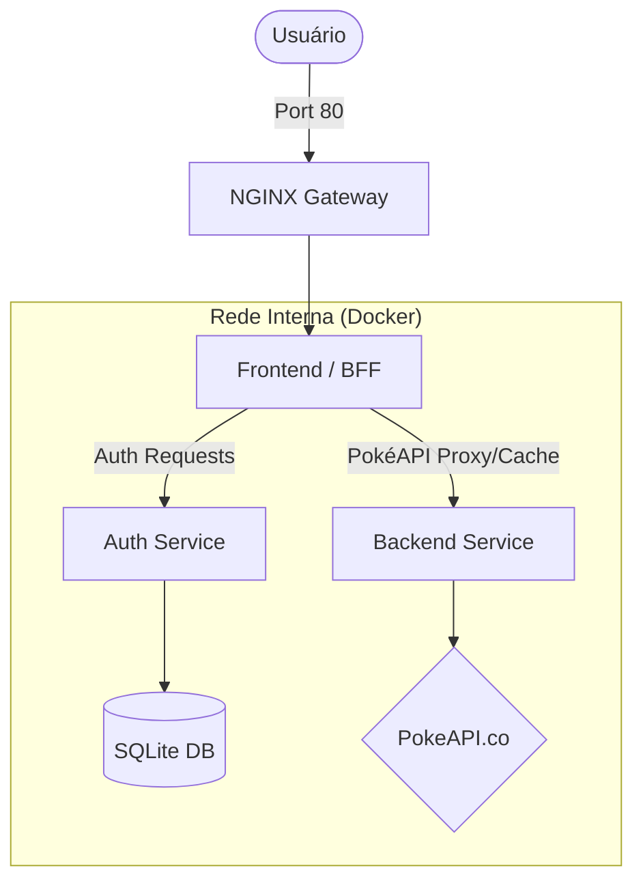

# 📱 Poké-API Tech Challenge & Application

Bem-vindo ao repositório do desafio técnico. Este projeto contém uma aplicação integrada (**Pokédex**) baseada em microsserviços e um desafio específico de lógica de programação (**Processamento de Pedidos**).

---

## 🚀 Como Rodar: Pokédex App (Principal)

A Pokédex é uma aplicação Full Stack com autenticação, cache e busca integrada à PokéAPI.

### 🛠️ Pré-requisitos
- [Docker Desktop](https://www.docker.com/products/docker-desktop/) instalado e rodando.

### 1️⃣ Configuração Inicial
Navegue até a pasta da aplicação e configure as variáveis de ambiente:
```bash
cd pokedex-app
cp .env.example .env
```
Edite o arquivo `.env` e defina um `SECRET_KEY`. Você pode gerar um com:
```bash
python -c "import secrets; print(secrets.token_hex(32))"
```

### 2️⃣ Build e Execução
Rode o comando abaixo para subir todos os serviços:
```bash
docker compose up --build
```
> **Nota:** No primeiro build, o processo pode levar cerca de 2 minutos. Aguarde até ver mensagens de `Application startup complete`.

### 3️⃣ Acesso à Aplicação
- **Frontend:** [http://localhost](http://localhost)
- **Registro:** [http://localhost/register](http://localhost/register)
- **Login:** [http://localhost/login](http://localhost/login)

---

## 🏗️ Arquitetura do Sistema

A aplicação utiliza uma arquitetura de microsserviços onde o Frontend atua como um **BFF (Backend for Frontend)**, centralizando a lógica de autenticação e comunicação interna.



### Componentes:
- **Nginx:** Ponto de entrada que encaminha o tráfego para o Frontend.
- **Frontend (Web):** Interface desenvolvida em FastAPI/Jinja2 que consome os serviços internos.
- **Auth-Service:** Responsável pelo gerenciamento de usuários e geração de JWT (tokens).
- **Backend:** Proxy para a PokéAPI com estratégia de cache para otimizar performance.

---

## ☁️ Deploy (Railway)

A estrutura está preparada para deploy simultâneo de serviços no Railway:
1. **Auth-Service:** Porta 8000 (Privado). Precisa de volume em `/app/data`.
2. **Backend:** Porta 8000 (Privado).
3. **Frontend:** Porta 8000 (Público). Recebe as URLs internas dos outros serviços via env vars.


---

## 🧪 Desafio: Agrupamento de Pedidos

Além da aplicação, este repositório contém a resolução do desafio de lógica: **Agrupar pedidos por categoria**, calculando totais e ticket médio.

### Exemplo de Dados
- Pedidos com `id`, `customer`, `product`, `category` e `price`.

### Como executar a solução (Python)
No diretório raiz:
```bash
python main.py
```

### Funcionalidades Implementadas
- [x] Agrupamento por categoria utilizando `reduce` (ou lógica equivalente em Python).
- [x] Soma total de preços por categoria.
- [x] Cálculo de ticket médio por categoria.
- [x] Contagem total de pedidos.

---

## 📂 Estrutura de Pastas
```text
.
├── pokedex-app/          # Aplicação principal
│   ├── auth-service/     # Serviço de autenticação
│   ├── backend/          # Serviço de dados (PokéAPI)
│   ├── frontend/         # Interface e BFF
│   └── nginx/            # Configuração de Proxy
├── main.py               # Solução do desafio de lógica
└── README.md             # Este arquivo
```

---
*Desenvolvido como parte de um teste técnico de arquitetura e desenvolvimento.*